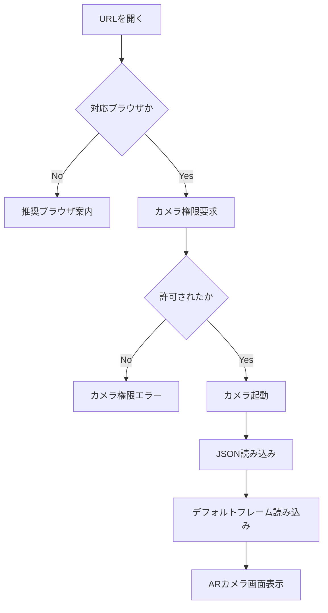
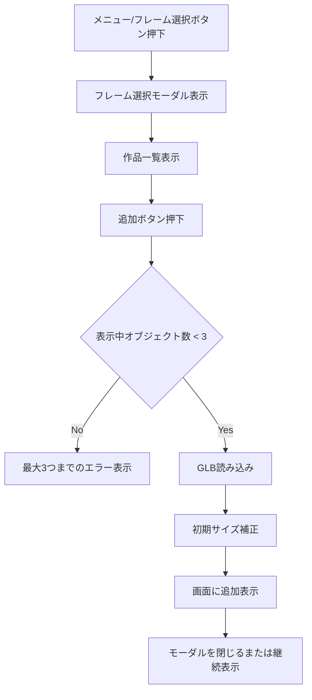
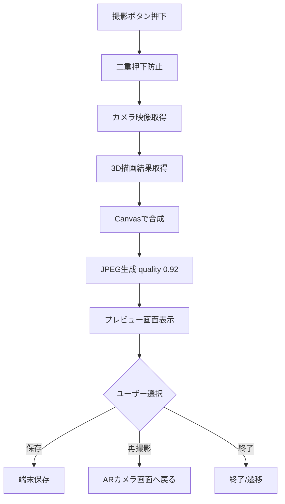

# ARフォトフレーム AI開発設計書

Version: v0.5  
Status: Draft
Revision Note: v0.5では、v0.4時点の矛盾を解消し、回転仕様、JSON例、章番号、AI実装プロンプト、状態管理項目を整理。  
Last Updated: 2026-07-05  
Target: AI実装向け仕様書 / PRD + Technical Design

---

## 0. このドキュメントの目的

このドキュメントは、スマートフォンのWebブラウザ上で動作する「ARフォトフレーム」機能を、AI開発支援ツール（Claude Code / Codex / ChatGPT等）に実装させるための仕様書である。

単なる要件メモではなく、以下を含む「AI開発設計書」として扱う。

- プロダクトの目的
- 利用者体験
- 画面仕様
- 操作仕様
- データ仕様
- JSONスキーマ
- TypeScript型定義
- 推奨ディレクトリ構成
- コンポーネント設計
- 状態管理方針
- カメラ・3D表示・撮影保存の実装方針
- エラー仕様
- 非機能要件
- 受け入れ条件
- 今回スコープ外
- 将来拡張

AI実装時は、本ドキュメントに記載された内容を優先し、スコープ外の機能を勝手に追加しないこと。

---

## 1. プロジェクト概要

本システムは、スマートフォンのWebブラウザ上で動作するARフォトフレーム機能である。

利用者はスマートフォンのカメラ映像上に、GLB形式の3Dフレームおよび装飾オブジェクトを重ねて表示し、位置やサイズを調整したうえで写真として保存できる。

初期リリースでは、フレームおよび装飾データはアプリケーション内の静的リソースとして管理する。DB管理、管理画面、アップロード機能は今回のスコープ外とする。

このアプリは「AR」と呼ぶが、初期リリースでは床・机などの平面検出や、マーカー認識、空間固定は行わない。カメラ映像に対して3Dオブジェクトを画面上に重ねて表示する「カメラ合成型AR」として実装する。

---

## 2. 背景・目的

本システムの目的は、学生が制作した3D作品を、一般利用者がスマートフォン上で気軽に体験できるARフォトフレームとして提供することである。

利用者は学生作品であるフレームや装飾を自由に組み合わせ、写真撮影を楽しむことができる。これにより、作品そのものの魅力や制作者を不特定多数の利用者に知ってもらう機会を創出する。

そのため、本システムでは単なるARカメラ機能だけではなく、各作品の制作者名や説明文を表示することを重要な要件とする。

---

## 3. 想定ユーザー

### 3.1 一般利用者

イベント会場やWebページ上のQRコードからARフォトフレームを起動し、学生作品を使って写真撮影を楽しむユーザー。

主な行動は以下。

- QRコードまたはURLからページを開く
- カメラ権限を許可する
- デフォルト表示されたフレームを確認する
- フレームや装飾を選択する
- 位置やサイズを調整する
- 写真を撮影する
- 端末に保存する

### 3.2 学生・制作者

GLB形式の3D作品を制作するユーザー。

初期リリースでは管理画面からのアップロードは行わないため、制作者が直接システムを操作することはない。ただし、作品名、ハンドルネーム、説明文、サムネイルは利用者に表示される。

### 3.3 運営者

初期リリースでは、運営者がリポジトリにGLB、サムネイル、JSONメタデータを追加することで作品を管理する。

将来的には管理画面からアップロード・編集できるようにする可能性がある。

---

## 4. 用語定義

| 用語 | 説明 |
|---|---|
| ARフォトフレーム | カメラ映像上に3Dフレームや装飾を重ねて撮影できる機能 |
| フレーム | 画面全体を四角く覆うタイプの3Dオブジェクト |
| 装飾 | キャラクター、ハート、星などのワンポイント3Dオブジェクト |
| オブジェクト | フレームと装飾を総称した表示対象 |
| GLB | 3Dモデルファイル形式。glTFのバイナリ形式 |
| サムネイル | フレーム選択モーダルに表示する作品プレビュー画像 |
| メタデータ | 作品名、作者名、説明文、GLBパスなどを管理するJSON情報 |
| カメラ合成 | カメラ映像と3D表示をCanvas等で合成し、画像として出力すること |
| 選択中オブジェクト | 利用者がタップし、移動・拡大縮小・削除の対象になっているオブジェクト |

---

## 5. 対象環境

### 5.1 対象端末

初期リリースの正式対象はスマートフォンとする。

- iPhone
- Androidスマートフォン

以下は初期リリースでは動作保証外とする。

- PCブラウザ
- タブレット
- フィーチャーフォン
- WebView内ブラウザ
- アプリ内ブラウザ（LINE内ブラウザ、X内ブラウザ、Instagram内ブラウザ等）

ただし、タブレットは実装上動作する可能性がある。正式な検証対象には含めない。

### 5.2 対応ブラウザ

正式対応ブラウザは以下とする。

| OS | 対応ブラウザ |
|---|---|
| iOS | Safari |
| Android | Chrome |

QRコード等から起動する場合、利用者向けに以下の案内を表示・掲示する。

- iPhoneの方はSafariで開いてください
- Androidの方はChromeで開いてください

アプリ内ブラウザで起動された場合は、SafariまたはChromeで開くよう案内する。

### 5.3 実行条件

- HTTPS環境で提供する
- カメラ権限が必要
- JavaScriptが有効であること
- WebGLが利用可能であること
- `navigator.mediaDevices.getUserMedia` が利用可能であること
- Canvasによる画像生成が可能であること

---

## 6. システム概要

初期リリースでは、サーバーサイドAPIやDBは使用しない。

フロントエンドアプリケーションが以下を行う。

1. 静的JSONから作品一覧を読み込む
2. カメラ映像を取得する
3. カメラ映像を画面に表示する
4. GLB形式の3Dオブジェクトを読み込む
5. 3Dオブジェクトをカメラ映像上に重ねる
6. タッチ操作で位置・サイズを調整する
7. 撮影ボタン押下時にカメラ映像と3D表示を合成する
8. JPEG形式でプレビュー表示する
9. ユーザー操作で端末に保存する

---

## 7. 機能要件

## 7.1 カメラ起動

### 概要

利用者がARフォトフレームページを開いたら、カメラ使用許可を求める。

### 要件

- ブラウザのMediaDevices APIを使用する
- 背面カメラを優先する
- カメラ起動中はローディング表示を出す
- カメラ権限が拒否された場合はエラー表示を行う
- カメラが利用できない端末では非対応メッセージを表示する

### 実装方針

```ts
navigator.mediaDevices.getUserMedia({
  video: {
    facingMode: { ideal: "environment" }
  },
  audio: false
});
```

背面カメラが取得できない場合は、ブラウザの判断に任せる。初期リリースではカメラ切替UIは実装しない。

---

## 7.2 AR表示

### 概要

スマートフォンのカメラ映像上に、GLB形式の3Dフレームおよび装飾オブジェクトを重ねて表示する。

### 要件

- カメラ映像を背景として表示する
- 3Dオブジェクトを前景として重ねる
- GLBファイルを読み込んで表示する
- 3Dオブジェクトは画面の動きに追従する
- 初期リリースでは空間固定しない
- 初期リリースでは平面検出しない
- 初期リリースではマーカー認識しない

### 補足

本仕様におけるAR表示は、WebXRの空間認識を必須としない。カメラ映像上に3Dオブジェクトを重ねる「疑似AR / カメラ合成型AR」として実装してよい。

---

## 7.3 オブジェクト分類

表示対象の3Dオブジェクトは以下の2種類に分類する。

### フレーム

画面全体を四角く覆うタイプのオブジェクト。

特徴:

- 写真全体を囲う
- 画面四隅に沿うような見た目
- 初回起動時のデフォルト表示対象になりうる
- 例: 桜のフレーム、学校祭フレーム、イベントロゴ付きフレーム

### 装飾

画面上にワンポイントで配置するオブジェクト。

特徴:

- キャラクター、ハート、星など
- ユーザーが自由に位置調整する
- ピンチで拡大縮小する
- フレームとは独立して扱う
- 例: マスコットキャラクター、吹き出し、星、ハート、3Dロゴ

---

## 7.4 同時表示数

### 要件

- 同時表示できる3Dオブジェクトは最大3つ
- フレームと装飾の合計で3つまで表示可能
- 組み合わせは自由

### 許可される組み合わせ例

| フレーム数 | 装飾数 | 合計 | 可否 |
|---:|---:|---:|---|
| 1 | 0 | 1 | 可 |
| 1 | 1 | 2 | 可 |
| 1 | 2 | 3 | 可 |
| 2 | 1 | 3 | 可 |
| 3 | 0 | 3 | 可 |
| 0 | 3 | 3 | 可 |
| 2 | 2 | 4 | 不可 |
| 0 | 4 | 4 | 不可 |

### 最大数超過時

4つ目のオブジェクトを追加しようとした場合は、以下のようなメッセージを表示する。

> 同時に表示できるのは3つまでです。不要なフレームまたは装飾を削除してください。

---

## 7.5 初期表示

### 要件

- 初回カメラ起動時は、デフォルトのフレームを1つ表示する
- 最初から何も表示されていない状態にはしない
- デフォルトフレームはJSONメタデータの `isDefault` で指定する

### 複数のデフォルト指定がある場合

初期リリースでは `isDefault: true` は1件のみを想定する。

ただし、誤って複数指定されていた場合は、JSON配列上で最初に見つかった1件を使用する。

### デフォルト指定がない場合

`isDefault: true` が存在しない場合は、`enabled: true` の最初の `frame` をデフォルト表示する。

それも存在しない場合は、エラーログを出し、オブジェクトなしでカメラ画面を表示する。ただし、ユーザーには「フレームを選択してください」と案内する。

---

## 7.6 オブジェクト操作

### 操作一覧

利用者は表示中のオブジェクトに対して以下の操作を行える。

| 操作 | 内容 |
|---|---|
| タップ | 操作対象として選択する |
| ドラッグ | 選択中オブジェクトを移動する |
| ピンチアウト | 選択中オブジェクトを拡大する |
| ピンチイン | 選択中オブジェクトを縮小する |
| 削除 | 選択中オブジェクトを画面から削除する |

### 初期リリースで実装しない操作

- フレームの回転
- 二本指回転ジェスチャー
- 奥行き移動
- AR空間固定
- 平面上への配置
- マーカー追従
- フレームと装飾のグループ化

装飾については、選択中オブジェクトの編集メニューから回転可能とする。

---

## 7.7 操作対象の選択

### 要件

- ユーザーがタップしたオブジェクトを操作対象とする
- 操作対象は1つのみ
- 他のオブジェクトをタップすると選択対象が切り替わる
- 選択中であることが分かるように視覚的フィードバックを表示する

### 視覚的フィードバック案

実装方式は問わないが、以下のいずれかを採用する。

- オブジェクト外枠
- 半透明のBounding Box
- 選択中オブジェクトの軽い発光
- 四隅のハンドル表示

### 非選択化

以下の場合、選択状態を解除してよい。

- 背景部分をタップした場合
- 撮影した場合
- プレビュー画面へ遷移した場合
- オブジェクトを削除した場合

---

## 7.8 オブジェクトの独立管理

### 要件

- フレームと装飾はすべて独立したオブジェクトとして管理する
- フレームと装飾の親子関係は持たない
- フレームを移動・拡大しても装飾は連動しない
- 作者が異なる作品を組み合わせる想定のため、作品単位で独立して扱う

### 理由

学生作品を複数組み合わせる場合、フレームと装飾の作者が異なる可能性が高い。そのため、フレームに装飾を従属させる設計にはしない。

---

## 7.9 写真撮影

### 概要

AR表示中の画面を撮影し、カメラ映像と3Dオブジェクトを合成した画像を生成する。

### 要件

- ネイティブカメラアプリは使用しない
- Webアプリ内で撮影処理を完結する
- カメラ映像と3D表示をCanvas等で合成する
- 撮影後はプレビュー画面を表示する
- 保存前に利用者が撮影結果を確認できる

### 保存形式

| 項目 | 値 |
|---|---|
| 画像形式 | JPEG |
| Quality | 0.92 |
| 透過 | 不要 |
| 保存先 | 端末 |

### 補足

カメラ映像がベースであるため、透過情報は不要。写真用途のためJPEGを採用する。

---

## 8. 画面仕様

## 8.1 画面一覧

| 画面ID | 画面名 | 説明 |
|---|---|---|
| AR001 | ARカメラ画面 | カメラ映像と3Dオブジェクトを表示するメイン画面 |
| AR002 | フレーム選択モーダル | フレーム・装飾を選択するモーダル |
| AR003 | 撮影プレビュー画面 | 撮影後の画像を確認・保存する画面 |
| AR004 | エラー画面 | カメラ権限拒否や非対応ブラウザ時の案内画面 |

---

## 8.2 ARカメラ画面

### 目的

利用者がカメラ映像を見ながらフレーム・装飾を配置し、撮影する画面。

### 表示要素

- カメラ映像
- 表示中の3Dオブジェクト
- 撮影ボタン
- メニュー／設定ボタン
- 選択中オブジェクト削除ボタン
- 戻る／閉じるボタン
- ローディング表示
- エラーメッセージ表示領域

### UI配置

| UI | 配置 | 補足 |
|---|---|---|
| 撮影ボタン | 画面下中央 | 一般的なカメラUIに近い大きめの円形ボタン |
| メニュー／設定ボタン | 画面右上または左上 | フレーム選択を開く |
| 削除ボタン | 選択時のみ表示 | 選択中オブジェクトを削除 |
| 戻る／閉じるボタン | 画面左上または右上 | ブラウザバックを避けるため画面内に設置 |

### 撮影ボタン

- 画面下中央に固定表示する
- 指で押しやすいサイズにする
- タップ時に撮影処理を開始する
- 撮影処理中は二重押下を防止する

### メニュー／設定ボタン

初期リリースでは「フレーム選択」を開く用途が中心である。

将来的に機能が増える可能性があるため、以下のどちらかで実装する。

#### 案A: フレーム選択専用ボタン

- 実装がシンプル
- 初期リリース向き

#### 案B: メニュー／設定ボタン

- 将来のメニュー拡張に強い
- メニュー内に「フレーム選択」を配置する

初期実装では案Aでもよいが、コンポーネント名は将来拡張しやすいよう `ARMenu` としてよい。

---

## 8.3 フレーム選択モーダル

### 目的

利用者が使用したいフレーム・装飾を選択する。

### 表示対象

- フレーム
- 装飾

### 表示情報

各作品について以下を表示する。

- サムネイル
- 作品名
- 作者のハンドルネーム
- 説明文
- 種別（フレーム / 装飾）
- 追加ボタン
- 追加済み表示

### モーダル採用理由

ボトムシートではなくモーダルとする。

理由:

- 作品名、作者名、説明文を表示する必要がある
- 学生作品の紹介が重要な目的である
- サムネイルをある程度大きく見せたい
- 装飾オブジェクトも含めるため情報量が多い

### 表示数上限との連動

表示中オブジェクトがすでに3つある場合、未追加オブジェクトの追加ボタンは押せない状態にするか、押下時にエラー表示する。

推奨実装:

- 追加ボタンをdisabledにする
- disabled理由として「最大3つまで」を表示する

---

## 8.4 撮影プレビュー画面

### 目的

撮影結果を利用者に確認させ、保存・再撮影・終了を選ばせる。

### 表示要素

- 撮影した画像
- 保存ボタン
- 再撮影ボタン
- 終了ボタン

### ボタン仕様

#### 保存

- JPEG画像を端末へ保存する
- 保存に失敗した場合は代替導線を表示する

#### 再撮影

- ARカメラ画面へ戻る
- フレーム・装飾の配置は維持する
- 拡大縮小率も維持する
- 選択状態は解除してよい

#### 終了

- AR画面を終了する
- 遷移先は呼び出し元ページまたはトップページとする
- 遷移先が未定の場合は、トップページ相当のURLを環境変数または定数で管理する

---

## 9. UIフロー

## 9.1 初回起動フロー



---

## 9.2 フレーム追加フロー



---

## 9.3 撮影フロー



---

## 10. データ仕様

## 10.1 初期リリースのデータ管理方針

初期リリースではDBを使用しない。

作品情報は、リポジトリ内のJSONファイルで管理する。

GLBファイルとサムネイル画像は静的アセットとして配置する。

### 管理対象

各作品は以下を持つ。

- GLBファイル
- サムネイル画像
- メタデータJSON

---

## 10.2 JSONファイル

推奨ファイルパス:

```txt
src/data/arObjects.json
```

または、ビルド環境に応じて以下でもよい。

```txt
public/data/arObjects.json
```

初期実装では、型チェックやimportしやすさを優先し、`src/data/arObjects.json` を推奨する。

---

## 10.3 JSONスキーマ

```json
[
  {
    "id": "frame_001",
    "type": "frame",
    "name": "春のフォトフレーム",
    "authorName": "sample_user",
    "description": "桜をテーマにしたARフレームです。",
    "glbPath": "/assets/ar-objects/frame_001/model.glb",
    "thumbnailPath": "/assets/ar-objects/frame_001/thumbnail.jpg",
    "isDefault": true,
    "initialScale": null,
    "rotatable": false,
    "enabled": true
  },
  {
    "id": "decoration_001",
    "type": "decoration",
    "name": "きらきら星",
    "authorName": "star_creator",
    "description": "写真を華やかにする星の装飾です。",
    "glbPath": "/assets/ar-objects/decoration_001/model.glb",
    "thumbnailPath": "/assets/ar-objects/decoration_001/thumbnail.jpg",
    "isDefault": false,
    "initialScale": null,
    "rotatable": true,
    "enabled": true
  }
]
```

---

## 10.4 フィールド定義

| フィールド | 型 | 必須 | 説明 |
|---|---|---:|---|
| id | string | yes | オブジェクトID。ユニークであること |
| type | "frame" / "decoration" | yes | フレームまたは装飾 |
| name | string | yes | 作品名 |
| authorName | string | yes | 制作者のハンドルネーム |
| description | string | yes | 作品説明文 |
| glbPath | string | yes | GLBファイルのパス |
| thumbnailPath | string | yes | サムネイル画像のパス |
| isDefault | boolean | no | 初回表示対象か |
| initialScale | number / null | no | 将来拡張用の初期倍率 |
| rotatable | boolean | no | 回転可能か。装飾はtrue、フレームはfalseを基本とする |
| enabled | boolean | no | 一覧に表示するか |

---

## 10.5 バリデーションルール

### id

- 必須
- 空文字不可
- 一意であること
- 半角英数字、アンダースコア、ハイフンを推奨

### type

- `frame`
- `decoration`

上記以外は無効。

### name

- 必須
- モーダルに表示する
- 長すぎる場合はUI側で折り返しまたは省略する

### authorName

- 必須
- 制作者のハンドルネーム
- 本名ではなくハンドルネームを想定

### description

- 必須
- 作品紹介として表示する
- 長文の場合はモーダル内で折り返す

### glbPath

- 必須
- GLBファイルへのパス
- 読み込み失敗時はエラー扱い

### thumbnailPath

- 必須
- サムネイル画像へのパス
- 読み込み失敗時はプレースホルダー画像を表示してもよい

### enabled

- `false` の場合、一覧に表示しない
- 未指定の場合は `true` として扱う

---

## 11. TypeScript型定義

## 11.1 ARObjectMeta

```ts
export type ARObjectType = "frame" | "decoration";

export type ARObjectMeta = {
  id: string;
  type: ARObjectType;
  name: string;
  authorName: string;
  description: string;
  glbPath: string;
  thumbnailPath: string;
  isDefault?: boolean;
  initialScale?: number | null;
  rotatable?: boolean;
  enabled?: boolean;
};
```

---

## 11.2 DisplayObject

```ts
export type DisplayObject = {
  instanceId: string;
  objectId: string;
  type: ARObjectType;
  name: string;
  authorName: string;
  description: string;
  glbPath: string;
  position: {
    x: number;
    y: number;
  };
  scale: number;
  rotation: number;
  zIndex: number;
  selected: boolean;
};
```

### objectId と instanceId の違い

同じ作品を複数追加できる可能性を残すため、表示インスタンスには `instanceId` を持たせる。

初期リリースで同一作品の複数追加を許可しない場合でも、内部設計として `instanceId` を持たせておくと将来拡張しやすい。

- `objectId`: JSON上の作品ID
- `instanceId`: 画面上に表示されている個別インスタンスID

---

## 11.3 ARState

```ts
export type ARState = {
  cameraStatus: "idle" | "requesting" | "active" | "denied" | "error";
  loadingStatus: "idle" | "loading" | "ready" | "error";
  displayObjects: DisplayObject[];
  selectedInstanceId: string | null;
  capturedImageUrl: string | null;
  isSelectionModalOpen: boolean;
  isTutorialOpen: boolean;
  hasSeenTutorial: boolean;
  isCapturing: boolean;
  errorMessage: string | null;
};
```

---

## 12. 表示サイズ補正

## 12.1 基本方針

GLBごとのサイズ差はシステム側で吸収する。

作者に制作ルールを周知しても、サイズが完全に揃う保証はないため、実装側で初期表示サイズを自動補正する。

---

## 12.2 補正方法

GLB読み込み後、Three.jsのBounding Boxを取得する。

```ts
const box = new THREE.Box3().setFromObject(object);
const size = new THREE.Vector3();
box.getSize(size);
```

取得したサイズをもとに、種別ごとの基準サイズへスケーリングする。

---

## 12.3 フレームの初期サイズ

フレームは画面全体を囲うように表示する。

### 要件

- 初期表示時に画面全体を囲う
- 画面四隅に自然に収まる
- カメラ画角に対してフレームとして見える

### 実装上の補足

フレームのGLB形状は作品ごとに異なる可能性があるため、厳密な画面四隅一致ではなく「フレームとして自然に画面を囲う見た目」を優先する。

---

## 12.4 装飾の初期サイズ

装飾は画面幅の約25%を目安に表示する。

### 要件

- 初期表示サイズは画面幅の約25%
- 実機評価後に調整可能
- 極端に大きい・小さいGLBでも一定サイズで表示されること

---

## 12.5 将来拡張

将来的には管理画面で個別に初期倍率を設定できるようにする。

そのため、JSONには `initialScale` を用意しておく。

初期リリースでは `initialScale` が指定されていれば優先し、未指定なら自動補正を使用する。

---

## 13. 状態管理

## 13.1 管理する状態

アプリケーションでは以下の状態を管理する。

- カメラ状態
- 作品メタデータ一覧
- 表示中オブジェクト一覧
- 選択中オブジェクト
- GLB読み込み状態
- 撮影中状態
- 撮影済み画像
- エラー情報
- モーダル表示状態

---

## 13.2 推奨状態管理

初期実装ではReactの標準機能で十分とする。

- `useState`
- `useReducer`
- `Context`

状態が複雑化した場合はZustand等を検討してよいが、初期リリースでは追加ライブラリを増やしすぎない。

### 推奨

```txt
useReducer + Context
```

理由:

- 状態遷移が明確になる
- AI実装で予測しやすい
- 外部ライブラリ依存を減らせる

---

## 13.3 再撮影時の状態保持

再撮影時は以下を維持する。

- 表示中オブジェクト
- 各オブジェクトの位置
- 各オブジェクトの拡大縮小率

解除してよいもの:

- 選択状態
- 撮影済み画像URL

---

## 13.4 削除時の状態

オブジェクト削除時は以下を行う。

- `displayObjects` から対象を削除
- `selectedInstanceId` が対象なら `null` にする
- 同時表示数カウントから外す

---

## 14. 推奨技術構成

## 14.1 フロントエンド

初期プロトタイプでは以下を推奨する。

- React
- TypeScript
- Vite
- Three.js
- React Three Fiber
- @react-three/drei
- MediaDevices API
- Canvas API

既存リポジトリがNext.jsの場合は、Next.jsに合わせて実装してよい。ただし、本仕様書ではフロント単体で動かしやすいVite + Reactを標準例とする。

---

## 14.2 3D読み込み

GLB読み込みには `useGLTF` または `GLTFLoader` を使用する。

React Three Fiberを使用する場合は、`@react-three/drei` の `useGLTF` を推奨する。

---

## 14.3 カメラ映像

カメラ映像は `video` 要素に流し込む。

```tsx
<video
  ref={videoRef}
  autoPlay
  playsInline
  muted
/>
```

iOS Safariでは `playsInline` が重要である。

---

## 14.4 3D描画

3D描画はカメラ映像の上に重ねる。

DOM構造イメージ:

```tsx
<div className="ar-root">
  <video className="camera-video" />
  <Canvas className="ar-canvas">
    <ARObjectRenderer />
  </Canvas>
  <AROverlayUI />
</div>
```

CSSでは、video、Canvas、UIを同じ領域に重ねる。

---

## 14.5 撮影合成

撮影時は以下を合成する。

1. video要素の現在フレーム
2. 3D Canvasの描画内容

実装上は、以下のような流れを想定する。

```ts
const outputCanvas = document.createElement("canvas");
const ctx = outputCanvas.getContext("2d");

ctx.drawImage(videoElement, 0, 0, width, height);
ctx.drawImage(threeCanvas, 0, 0, width, height);

const dataUrl = outputCanvas.toDataURL("image/jpeg", 0.92);
```

注意点:

- videoと3D canvasの表示サイズを一致させる
- devicePixelRatioを考慮する
- iOS SafariでCanvas出力に制約が出る場合があるため実機確認する

---

## 15. 推奨ディレクトリ構成

```txt
src/
  main.tsx
  App.tsx

  pages/
    ARPhotoFramePage.tsx

  components/
    ar/
      ARCameraView.tsx
      ARCanvasLayer.tsx
      ARObjectRenderer.tsx
      ARObjectSelectionModal.tsx
      ARCapturePreview.tsx
      ARMenu.tsx
      ARToolbar.tsx
      ARErrorView.tsx
      ARLoadingView.tsx

  hooks/
    useCameraStream.ts
    useARObjects.ts
    useObjectGesture.ts
    useCaptureCanvas.ts
    useBrowserSupport.ts

  state/
    arReducer.ts
    arContext.tsx

  data/
    arObjects.json

  types/
    arObject.ts
    arState.ts

  utils/
    normalizeModelScale.ts
    captureToJpeg.ts
    browserSupport.ts
    createInstanceId.ts

  styles/
    arPhotoFrame.css

public/
  assets/
    ar-objects/
      frame_001/
        model.glb
        thumbnail.jpg
      decoration_001/
        model.glb
        thumbnail.jpg
```

---

## 16. コンポーネント設計

## 16.1 ARPhotoFramePage

### 役割

ARフォトフレーム全体の親コンポーネント。

### 責務

- 状態管理Providerを配置する
- カメラ画面、モーダル、プレビュー画面を切り替える
- エラー画面を制御する

---

## 16.2 ARCameraView

### 役割

カメラ映像を表示する。

### 責務

- カメラストリーム取得
- video要素へのstream設定
- カメラ権限エラーの通知

---

## 16.3 ARCanvasLayer

### 役割

3Dオブジェクト描画用Canvasを表示する。

### 責務

- React Three Fiber Canvasを配置
- カメラ映像と同じ表示領域に重ねる
- 画面サイズ変更に追従する

---

## 16.4 ARObjectRenderer

### 役割

表示中オブジェクトを描画する。

### 責務

- DisplayObject一覧を受け取る
- GLBを読み込む
- 位置、scale、selected状態を反映する
- タップイベントを処理する

---

## 16.5 ARObjectSelectionModal

### 役割

フレーム・装飾の一覧を表示し、追加操作を行う。

### 責務

- サムネイル表示
- 作品名表示
- 作者名表示
- 説明文表示
- 追加ボタン表示
- 最大3つ制限の制御

---

## 16.6 ARCapturePreview

### 役割

撮影後のプレビューを表示する。

### 責務

- 撮影画像表示
- 保存ボタン
- 再撮影ボタン
- 終了ボタン

---

## 16.7 ARToolbar

### 役割

撮影ボタンや削除ボタンなどの主要操作UIを表示する。

### 責務

- 撮影ボタン
- 選択中オブジェクト削除ボタン
- メニュー起動ボタン
- 戻る／閉じるボタン

---

## 17. Hooks設計

## 17.1 useCameraStream

### 役割

カメラストリームを取得・管理する。

### 戻り値例

```ts
type UseCameraStreamResult = {
  videoRef: React.RefObject<HTMLVideoElement>;
  stream: MediaStream | null;
  status: "idle" | "requesting" | "active" | "denied" | "error";
  error: Error | null;
  startCamera: () => Promise<void>;
  stopCamera: () => void;
};
```

---

## 17.2 useARObjects

### 役割

作品メタデータと表示中オブジェクトを管理する。

### 機能

- JSON読み込み
- デフォルトフレーム選択
- オブジェクト追加
- オブジェクト削除
- 選択状態変更
- 最大3つ制限

---

## 17.3 useObjectGesture

### 役割

タッチ操作を処理する。

### 機能

- タップ選択
- ドラッグ移動
- ピンチ拡大縮小

### 注意

マルチタッチ処理はブラウザ差が出やすいため、実装後にiOS Safari / Android Chromeで実機確認する。

---

## 17.4 useCaptureCanvas

### 役割

撮影合成処理を行う。

### 機能

- video要素から現在フレームを取得
- Three.js Canvasから描画結果を取得
- Canvasで合成
- JPEG Data URLを生成
- 保存用Blobを生成

---

## 18. エラー仕様

## 18.1 カメラ権限拒否

### 発生条件

- ユーザーがカメラ権限を拒否した
- ブラウザ設定でカメラがブロックされている

### 表示文案

```txt
カメラを使用できません。
ARフォトフレームを利用するには、ブラウザのカメラ権限を許可してください。
```

---

## 18.2 非対応ブラウザ

### 発生条件

- iOS Safari / Android Chrome以外で開いた
- 必要なAPIが利用できない
- WebGLが利用できない
- getUserMediaが利用できない

### 表示文案

```txt
このブラウザではARフォトフレームを利用できない可能性があります。
iPhoneの方はSafari、Androidの方はChromeで開いてください。
```

---

## 18.3 GLB読み込み失敗

### 発生条件

- GLBファイルのパスが不正
- GLBファイルが破損している
- ネットワークエラー
- Three.js側で読み込みに失敗

### 挙動

- 対象オブジェクトを表示しない
- 他のオブジェクトやカメラ機能は継続利用可能とする
- モーダル上または画面上に読み込み失敗を表示する

---

## 18.4 最大表示数超過

### 発生条件

4つ目のオブジェクトを追加しようとした場合。

### 表示文案

```txt
同時に表示できるのは3つまでです。
不要なフレームまたは装飾を削除してください。
```

---

## 18.5 保存失敗

### 発生条件

- 端末保存に失敗した
- ブラウザ制約で自動保存できない
- Data URL / Blob生成に失敗した

### 代替導線

- 画像を別タブで開く
- 長押し保存を案内する
- 再撮影を促す

---

## 19. 非機能要件

## 19.1 パフォーマンス

- スマートフォン上で操作に大きな遅延が出ないこと
- GLBファイルは可能な限り軽量化すること
- 初回読み込み中はローディング表示を出すこと
- 表示オブジェクト数を最大3つに制限することで負荷を抑える
- 不要になったGLBやTextureは可能な範囲で解放する

---

## 19.2 ユーザビリティ

- スマートフォン縦向き利用を優先する
- 主要操作は片手でも押しやすい位置に配置する
- 撮影ボタンは画面下中央に配置する
- 選択中オブジェクトが分かるようにする
- 最初に何も表示されない状態を避ける
- 失敗時はユーザーが次に何をすればいいか分かるメッセージを出す

---

## 19.3 アクセシビリティ

- ボタンには分かりやすいラベルを設定する
- アイコンのみの場合も `aria-label` を付与する
- エラーメッセージは文字で表示する
- 色だけで状態を伝えない
- タップ領域は十分な大きさを確保する

---

## 19.4 セキュリティ・プライバシー

- カメラ映像は端末内でのみ使用する
- 初期リリースでは撮影画像をサーバーへアップロードしない
- 撮影画像はユーザー操作によって端末保存される
- カメラ映像を外部送信しない
- 外部APIに画像を送らない

---

## 19.5 保守性

- フレーム／装飾の追加はJSONと静的アセットの追加で対応できること
- 将来のDB化・管理画面化を見据え、JSON構造はAPIレスポンスに近い形にすること
- フレームと装飾は同一のDisplayObject構造で扱うこと
- コンポーネント責務を分けること
- カメラ、3D描画、撮影合成、UI状態管理を密結合させすぎないこと

---

## 20. 受け入れ条件

初期リリースの完了条件は以下とする。

### カメラ

- スマートフォンブラウザでカメラ映像が表示される
- iOS Safariでカメラが起動する
- Android Chromeでカメラが起動する
- カメラ権限拒否時に適切なエラーが表示される

### 初期表示

- 初回起動時にデフォルトフレームが表示される
- 最初から何も表示されない状態にならない

### フレーム選択

- フレーム／装飾一覧をモーダルで開ける
- モーダルにサムネイル、作品名、作者名、説明文が表示される
- フレーム／装飾を追加できる

### 表示数制限

- フレーム／装飾を合計最大3つまで表示できる
- 4つ目を追加しようとするとエラーまたは通知が表示される

### 操作

- タップしたオブジェクトを選択できる
- 選択中オブジェクトが視覚的に分かる
- 選択中オブジェクトを移動できる
- 選択中オブジェクトをピンチイン／ピンチアウトで拡大縮小できる
- 選択中オブジェクトを削除できる
- フレームの回転操作は存在しない。装飾は回転可能

### 撮影

- 撮影ボタンでプレビュー画像を生成できる
- カメラ映像と3Dオブジェクトが合成された画像になる
- プレビュー画面で保存／再撮影／終了ができる
- 保存画像はJPEG、Quality 0.92で生成される
- 再撮影時にオブジェクト配置と拡大縮小率が維持される

### 非対応環境

- 非対応ブラウザ時に推奨ブラウザ案内が表示される
- GLB読み込み失敗時にアプリ全体が落ちない

---

## 21. 今回スコープ外

以下は初期リリースでは実装しない。

- 管理画面
- GLBファイルアップロード
- フレーム編集
- DB管理
- APIによるフレーム管理
- 撮影画像のサーバー保存
- ユーザーアカウント
- お気に入り機能
- 作者ランキング
- フレーム回転操作
- AR空間への固定配置
- 平面検出
- マーカー認識
- 顔認識
- SNS投稿の自動連携
- アプリ内課金
- ログイン機能
- アクセス解析の詳細実装

---

## 22. 将来拡張

将来的には以下を検討する。

### 管理機能

- 管理画面からGLBファイルをアップロード
- 管理画面から作品名、作者名、説明文、サムネイルを編集
- DBによるフレーム／装飾管理
- API経由でフレーム一覧を取得
- 公開／非公開管理
- 作者別一覧
- 作品カテゴリ管理

### 表示・操作機能

- 個別オブジェクトの初期倍率設定
- フレーム回転操作の追加
- フレームごとの推奨配置
- 装飾の初期位置指定
- 複数オブジェクトのグループ化
- 平面検出
- マーカー認識

### 共有機能

- 撮影画像の共有機能
- SNS投稿導線
- QRコード共有
- ギャラリー機能

---

## 23. AI実装ガイド

## 23.1 実装AIへの指示

AIは以下を守ること。

- 本仕様書に記載された機能を優先して実装する
- スコープ外機能を勝手に実装しない
- 未確定事項を独自判断で大きく拡張しない
- まずは最小構成で動作するプロトタイプを作成する
- その後、UI調整、実機検証、パフォーマンス調整を行う
- 実機評価後に初期サイズやUI配置は調整可能とする
- カメラ、3D表示、撮影保存は分離して実装する
- 型定義を先に作成する
- JSONサンプルを用意する
- ダミーGLBがない場合はプレースホルダーを使う

---

## 23.2 推奨実装順

AIは以下の順で実装することを推奨する。

1. React + TypeScriptプロジェクト作成
2. 画面レイアウト作成
3. カメラ映像表示
4. 静的JSON読み込み
5. フレーム選択モーダル作成
6. GLB読み込み
7. デフォルトフレーム表示
8. オブジェクト追加・削除
9. タップ選択
10. ドラッグ移動
11. ピンチ拡大縮小
12. 撮影合成
13. プレビュー画面
14. JPEG保存
15. エラー処理
16. 実機調整

---

## 23.3 実装時の注意

### iOS Safari

- `video` には `playsInline` を付与する
- 自動再生制限に注意する
- カメラ権限の挙動を実機確認する
- Canvas保存処理を実機確認する

### Android Chrome

- 背面カメラ指定の挙動を確認する
- 端末サイズ差を確認する
- ピンチ操作を確認する

### GLB

- ファイルサイズが大きいと読み込みが遅くなる
- テクスチャサイズに注意する
- 作品ごとのスケール差を補正する

---

## 24. 決定事項まとめ

- スマートフォンWebブラウザで動作するARフォトフレーム
- カメラ映像上に3Dオブジェクトを重ねる
- GLB形式を使用する
- フレームと装飾を扱う
- フレームと装飾は合計最大3つまで同時表示
- オブジェクトはすべて独立管理
- 初回起動時はデフォルトフレームを表示
- フレーム選択はモーダル
- 作品名、作者名、説明文、サムネイルを表示
- タップしたオブジェクトを操作対象にする
- 移動、拡大、縮小に対応
- フレームの回転は初期リリースでは不要。装飾は回転可能とする
- 撮影後はJPEG Quality 0.92で保存
- 再撮影時は配置を維持
- DB、管理画面、アップロードは初期リリースでは対象外
- AI実装向けに、React + TypeScript + Three.js構成を推奨する

---


---

## 25. デプロイ方針

## 26.1 初期検証環境

初期検証環境として GitHub Pages を利用する。

GitHub Pages は静的Webサイトとして配信でき、HTTPSでアクセスできるため、スマートフォンブラウザでカメラ機能を検証する用途に適している。

### 用途

- 開発途中の動作確認
- スマートフォン実機でのカメラ起動確認
- iOS Safari / Android Chromeでの表示確認
- 関係者への検証用URL共有
- GLB表示、タッチ操作、撮影保存の初期検証

### 位置づけ

GitHub Pagesは本番環境ではなく、あくまで開発・検証用の一時配信環境とする。

最終的には、既に取得済みの独自ドメインで運用しているホームページ側へ組み込む想定とする。

---

## 26.2 本番公開方針

本番公開時は、既存ホームページ配下にARフォトフレーム機能を配置する。

想定例:

```txt
https://example.com/ar-photo-frame/
```

または、既存サイト構成に合わせて以下のようなパスに配置する。

```txt
https://example.com/event/ar-photo-frame/
https://example.com/special/ar-photo-frame/
```

本番URLはQRコードとして配布される可能性があるため、公開後にURL構造が頻繁に変わらないようにする。

---

## 26.3 デプロイ方式によって確認が必要な事項

既存ホームページ側へ組み込む場合、以下の点は事前に確認が必要である。

### 既存ホームページの配信方式

以下のどれに該当するか確認する。

- 静的HTMLサイト
- WordPress等のCMS
- Next.js / Nuxt等のフロントエンドフレームワーク
- Laravel / Rails等のサーバーサイドアプリ
- レンタルサーバー上の静的ファイル配信
- S3 / CloudFront等の静的ホスティング
- その他のホスティングサービス

配信方式によって、ビルド後ファイルの置き場所、パス設定、ルーティング設定が変わる。

### 配置パス

ARフォトフレームがドメイン直下に置かれるのか、サブディレクトリ配下に置かれるのかを確認する。

```txt
https://example.com/
```

に配置する場合と、

```txt
https://example.com/ar-photo-frame/
```

に配置する場合では、ビルド時のbase path設定が変わる。

Viteを使用する場合、サブディレクトリ配信では `vite.config.ts` の `base` 設定を調整する必要がある。

例:

```ts
export default defineConfig({
  base: "/ar-photo-frame/",
});
```

GitHub Pagesでリポジトリ名配下に配信する場合も、同様にbase pathの調整が必要になる。

---

## 26.4 静的アセットのパス

GLBファイル、サムネイル画像、JSONファイルは静的アセットとして配信される。

本番配置時に以下が正しく参照できることを確認する。

- GLBファイル
- サムネイル画像
- arObjects.json
- JavaScript bundle
- CSS
- その他画像ファイル

特に、サブディレクトリ配信時は `/assets/...` のようなルート相対パスが期待通りに動かない可能性がある。

そのため、実装ではビルド環境のbase pathに追従できるようにする。

---

## 26.5 HTTPS要件

本システムはカメラを使用するため、HTTPS環境で提供する必要がある。

開発検証環境、本番環境ともに、スマートフォンからHTTPSでアクセスできることを必須条件とする。

HTTPのみの環境では、カメラ起動が失敗する可能性が高いため、本番公開前に必ず確認する。

---

## 26.6 QRコード運用

利用者はQRコードからARフォトフレームを開く想定がある。

QRコード運用では以下を考慮する。

- QRコードに埋め込むURLは本番公開後に変更しにくい
- GitHub Pagesの検証用URLを本番QRコードに使わない
- 本番URL確定後にQRコードを作成する
- アプリ内ブラウザで開かれる可能性があるため、Safari / Chromeで開く案内を表示する
- iPhone向け、Android向けに推奨ブラウザ案内を入れる

---

## 26.7 本番移設時に確認したい質問

本番環境へ移す前に、実装者またはプロダクトオーナーへ以下を確認する。

1. 既存ホームページは何で構築されているか
   - 静的HTML
   - WordPress
   - 独自CMS
   - Next.js / Nuxt
   - Laravel / Rails
   - その他

2. ARフォトフレームはどのURL配下に配置するか
   - ドメイン直下
   - `/ar-photo-frame/`
   - イベントページ配下
   - その他

3. ビルド済みファイルを配置できる場所はあるか
   - HTML
   - JS
   - CSS
   - assets
   - GLB
   - JSON

4. HTTPSは有効か

5. サーバー側で特殊なルーティング制御があるか

6. 大きめのGLBファイルを配信して問題ないか
   - ファイルサイズ制限
   - MIME type
   - キャッシュ設定

7. `.glb` ファイルのMIME typeが正しく返るか

8. 本番URLはQRコード化しても変更されないか

---

## 26.8 デプロイに関する受け入れ条件

開発検証環境:

- GitHub Pages上でARフォトフレームが表示される
- スマートフォンからHTTPSでアクセスできる
- iOS Safariでカメラが起動する
- Android Chromeでカメラが起動する
- GLBとサムネイルが正しく読み込まれる
- 撮影・保存の検証ができる

本番環境:

- 独自ドメインの既存ホームページ配下で表示される
- HTTPSでアクセスできる
- QRコードからアクセスできる
- Safari / Chromeでカメラが起動する
- 静的アセットのパス切れがない
- GitHub Pages用のbase path設定が本番用に調整されている


---

## 26. 実機利用時の詳細挙動

この章では、実機利用時に挙動が曖昧になりやすい項目を定義する。

---

## 26.1 撮影画像のサイズ・向き

初期リリースでは、撮影画像はスマートフォン縦向き表示を前提とする。

保存画像は、ユーザーがARカメラ画面で見ている状態をそのまま再現する。カメラ映像、フレーム、装飾の位置関係は、撮影時の画面表示と一致させる。

解像度は端末の画面表示サイズを基準とし、可能な範囲で `devicePixelRatio` を考慮する。ただし、カメラの実解像度に合わせて保存することは初期リリースでは必須としない。

本仕様では、高解像度撮影よりも「見たまま保存される」体験を優先する。

---

## 26.2 撮影画像に含める要素

撮影画像には、以下のみを含める。

- カメラ映像
- 表示中のフレーム
- 表示中の装飾

以下のUI要素は撮影画像に含めない。

- 撮影ボタン
- メニュー／設定ボタン
- ？ボタン
- 削除ボタン
- 前面／背面ボタン
- 回転ボタン
- 選択中オブジェクトの外枠
- チュートリアルポップアップ
- エラーメッセージ
- ローディング表示

撮影処理では、UIレイヤーを除外し、カメラ映像レイヤーと3Dオブジェクトレイヤーのみを合成する。

選択中オブジェクトの外枠やBounding Boxは、3Dオブジェクトそのものではなく操作補助UIとして扱い、撮影画像には含めない。

---

## 26.3 保存ファイル名

保存画像のファイル名は以下の形式とする。

```txt
ar-photo-frame-YYYYMMDD-HHmmss.jpg
```

例:

```txt
ar-photo-frame-20260705-234512.jpg
```

日時はユーザー端末のローカル時刻を使用する。

---

## 26.4 オブジェクトの重なり順

実装上は、各表示インスタンスに `zIndex` または同等の重なり順を管理する値を持たせる。

`zIndex` は表示中インスタンス単位で管理し、作品ID単位では管理しない。


後から追加したオブジェクトほど前面に表示する。

タップして選択したオブジェクトは、操作しやすいように前面へ移動してよい。

選択中オブジェクトに対して、重なり順を変更できる操作を用意する。

- 前面へ
- 背面へ

最大表示数は3つのため、初期リリースでは「1つ前へ」「1つ後ろへ」のような細かい階層操作ではなく、前面／背面への移動で十分とする。

最前面のオブジェクトで「前面へ」を押した場合、または最背面のオブジェクトで「背面へ」を押した場合は、ボタンをdisabledにするか、操作しても何も起きないものとする。

---

## 26.5 同一作品の複数追加

初期リリースでは、同じ作品を複数追加できる。

- フレームの複数追加を許可する
- 装飾の複数追加を許可する
- タイプを問わず、同一作品を複数回追加してよい
- ただし、同時表示数の上限は引き続き合計3つまでとする

これにより、同じフレームを複数重ねて内側へ縮小配置し、合わせ鏡のような演出を作ることもできる。

---

## 26.6 表示中インスタンス管理

同じ作品を複数追加できるため、表示中オブジェクトは作品IDではなくインスタンスIDで管理する。

- `objectId`: JSON上の作品ID
- `instanceId`: 画面上に表示されている個別インスタンスID

例:

```ts
objectId: "frame_sakura_001"

instanceId: "frame_sakura_001__001"
instanceId: "frame_sakura_001__002"
instanceId: "frame_sakura_001__003"
```

フレーム選択モーダルでは、各作品について現在表示中のインスタンス数を表示する。

同じ作品が複数表示されている場合は、表示中インスタンスごとに以下の操作を行えるようにする。

- 選択
- 削除
- 中央に戻す

「中央に戻す」は、対象インスタンスの位置を画面中央へ戻し、scaleを初期値に戻す操作とする。見失ったオブジェクトの復帰手段として利用する。

同一作品が複数表示されている場合、ユーザーが意図したインスタンスとは別のインスタンスを削除・選択する可能性がある。このリスクは、インスタンス一覧表示、選択時の視覚的フィードバック、中央に戻す操作によって軽減する。

---

## 26.7 画面外にはみ出した時の挙動

オブジェクトをドラッグ移動する際、オブジェクトの中心点は画面外に出ないように制限する。

ただし、オブジェクトの一部が画面外にはみ出すことは許可する。

これにより、画面端に装飾を寄せる表現を許可しつつ、オブジェクトを完全に見失うことを防ぐ。

判定には、オブジェクトの表示サイズまたはBounding Boxを利用する。

---

## 26.8 拡大縮小の制限

オブジェクトはピンチイン／ピンチアウトで拡大縮小できる。

初期表示時の自動補正後サイズを `scale: 1.0` として扱う。

ユーザー操作による倍率は以下の範囲に制限する。

- 最小倍率: 0.2
- 最大倍率: 3.0

この範囲を超える拡大縮小操作が行われた場合は、最小値または最大値で clamp する。

オブジェクトを小さくしすぎて見失った場合は、フレーム選択モーダルの表示中インスタンス一覧から、対象オブジェクトを削除または中央に戻すことで復帰できるようにする。

---

## 26.9 回転操作

初期リリースでは、装飾のみ回転可能とする。

フレームは写真全体を囲う役割があるため、初期リリースでは回転不可とする。フレームの回転は、利用者要望や作品表現上の必要が出た場合に将来拡張として検討する。

### 回転対象

| type | 回転可否 |
|---|---|
| frame | 不可 |
| decoration | 可 |

### JSON指定

各作品メタデータには `rotatable` を持たせる。

```json
{
  "id": "decoration_star_001",
  "type": "decoration",
  "rotatable": true
}
```

フレームは原則以下とする。

```json
{
  "id": "frame_sakura_001",
  "type": "frame",
  "rotatable": false
}
```

### 操作方法

初期リリースでは、二本指回転ジェスチャーではなく、選択中オブジェクトの編集メニューに回転操作を用意する。

二本指回転はピンチ拡大縮小と競合しやすいため、初期リリースでは必須としない。

回転UI案:

- 左回転ボタン
- 右回転ボタン
- 回転スライダー

最小実装では、左右回転ボタンで一定角度ずつ回転する方式でもよい。

---

## 26.10 実写被写体とARオブジェクトの前後関係

初期リリースでは、カメラ映像を背景レイヤーとして扱い、その上にフレームおよび装飾オブジェクトを重ねて表示する。

そのため、カメラ映像内に映る人物・背景・物体は、すべてARオブジェクトの背面に表示される。

人物だけをARオブジェクトの前面に出す、または現実空間の奥行きに応じてARオブジェクトを隠す、といったオクルージョン表現は初期リリースでは実装しない。

オクルージョン表現は、将来拡張として検討する。

---

## 26.11 操作チュートリアル

初回起動時に、ARフォトフレームの基本操作を説明するチュートリアルポップアップを表示する。

チュートリアルの自動表示は初回のみとする。一度閉じた後は、次回以降の起動時には自動表示しない。

ただし、画面右下に「？」ボタンを常駐させる。ユーザーが「？」ボタンを押すと、いつでも操作方法を再表示できる。

### 表示タイミング

カメラ起動後、デフォルトフレームが表示された後にチュートリアルを表示する。

### 表示内容

- フレームや装飾をタップすると選択できます
- 選択したオブジェクトはドラッグで移動できます
- ピンチイン／ピンチアウトでサイズ変更できます
- 装飾は回転できます
- 選択中のオブジェクトは削除できます
- 前面／背面を切り替えられます
- 見失ったオブジェクトは一覧から削除または中央に戻せます
- 撮影ボタンで写真を撮れます
- フレーム選択から作品を追加できます

### 表示履歴

初回表示済みかどうかは、初期リリースでは `localStorage` で管理してよい。

---

## 26.12 サムネイル仕様

フレーム選択モーダルに表示するサムネイル画像は、JPEGまたはPNG形式とする。

推奨サイズは 512 x 512 px の正方形とする。

モーダル内では正方形で表示し、必要に応じて中央トリミングしてよい。

サムネイルの表示位置や見切れが気になる場合は、運用側で画像を調整する。

---

## 26.13 ファイル命名規則

初期リリースでは、作品IDとフォルダ名を一致させる。

```txt
public/assets/ar-objects/
  frame_sakura_001/
    model.glb
    thumbnail.jpg
  decoration_star_001/
    model.glb
    thumbnail.jpg
```

### 命名ルール

- 作品IDとフォルダ名は一致させる
- GLBファイル名は `model.glb` に統一する
- サムネイルファイル名は `thumbnail.jpg` または `thumbnail.png` に統一する
- フレームのIDは `frame_名前_連番` を推奨する
- 装飾のIDは `decoration_名前_連番` を推奨する
- IDは半角英数字、ハイフン、アンダースコアのみを使用する

多少命名が崩れた場合は、運用側で修正する。

---

## 26.14 GLB制作前提

学生向けの詳細な制作ガイドラインは別紙として作成する。

本仕様書では、実装上必要な前提のみ記載する。

- 3Dモデル形式は `.glb` とする
- フレーム・装飾ともにGLBで管理する
- 作品ごとのサイズ差はシステム側でBounding Boxを取得して補正する
- ただし、極端に大きい・小さい・原点が大きくずれたモデルは表示崩れの原因になる
- GLBごとにサムネイル画像を用意する
- 作品IDとフォルダ名は一致させる
- 初期リリースでは、GLB・サムネイル・JSONを静的アセットとして配置する

---

## 26.15 人向け運用ドキュメント

学生向けの制作ガイドライン、作品提出ルール、ファイル命名ルール、サムネイル作成ルール、運用側の修正手順は、AI開発設計書とは別に人向けドキュメントとして作成する。

本仕様書には、実装に必要な前提のみ記載する。

---

## 26.16 実機テストチェックリスト

実機確認では以下を確認する。

### 起動

- iPhone Safariで起動できる
- Android Chromeで起動できる
- GitHub PagesのURLで起動できる
- QRコードから起動できる
- アプリ内ブラウザで開いた場合に推奨ブラウザ案内が表示される

### カメラ

- カメラ権限許可後に映像が表示される
- カメラ権限拒否時にエラーが表示される
- 背面カメラが優先される

### 初期表示・チュートリアル

- デフォルトフレームが表示される
- 初回のみチュートリアルが表示される
- ？ボタンが右下に常駐する
- ？ボタンから操作方法を再表示できる

### オブジェクト操作

- フレームを追加できる
- 装飾を追加できる
- 同じ作品を複数追加できる
- 最大3つ制限が機能する
- タップしたオブジェクトを選択できる
- 選択中オブジェクトが視覚的に分かる
- ドラッグ移動できる
- ピンチで拡大縮小できる
- 装飾を回転できる
- フレームは回転できない
- 前面／背面を変更できる
- 中央に戻す操作ができる
- 削除できる

### 画面外・見失い対策

- オブジェクトの中心点が画面外に出ない
- 一部は画面外にはみ出せる
- 小さくしたオブジェクトを一覧から削除できる
- 小さくしたオブジェクトを中央に戻せる

### 撮影・保存

- 撮影ボタンでプレビュー画像が生成される
- 撮影画像にUIが含まれない
- 見たままの比率で保存される
- JPEG Quality 0.92で保存される
- 保存ファイル名が `ar-photo-frame-YYYYMMDD-HHmmss.jpg` になる
- 再撮影時にオブジェクト配置が維持される


## 27. 未確定事項

以下は実装前または実装中に確認・調整する。

| 項目 | 現時点の方針 | 備考 |
|---|---|---|
| 実際のフレームGLB仕様 | システム側でサイズ補正 | 実物GLBで調整が必要 |
| フレーム初期表示位置 | 画面四隅に沿う | モデル形状により調整 |
| 装飾初期サイズ | 画面幅の約25% | 実機評価後に調整 |
| メニューUI | 専用ボタンまたは設定ボタン | 将来拡張を考慮 |
| 終了時遷移先 | 呼び出し元またはトップ | 実装時に定数化 |
| 保存方法 | JPEG保存 | iOS Safariで要検証 |

---

## 28. 付録: サンプル arObjects.json

```json
[
  {
    "id": "frame_default_001",
    "type": "frame",
    "name": "デフォルトフレーム",
    "authorName": "sample_creator",
    "description": "初回起動時に表示されるサンプルフレームです。",
    "glbPath": "/assets/ar-objects/frame_default_001/model.glb",
    "thumbnailPath": "/assets/ar-objects/frame_default_001/thumbnail.jpg",
    "isDefault": true,
    "initialScale": null,
    "rotatable": false,
    "enabled": true
  },
  {
    "id": "decoration_star_001",
    "type": "decoration",
    "name": "星の装飾",
    "authorName": "star_creator",
    "description": "写真を華やかにする星の3D装飾です。",
    "glbPath": "/assets/ar-objects/decoration_star_001/model.glb",
    "thumbnailPath": "/assets/ar-objects/decoration_star_001/thumbnail.jpg",
    "isDefault": false,
    "initialScale": null,
    "rotatable": true,
    "enabled": true
  },
  {
    "id": "decoration_heart_001",
    "type": "decoration",
    "name": "ハートの装飾",
    "authorName": "heart_creator",
    "description": "画面上に配置できるハート型の3D装飾です。",
    "glbPath": "/assets/ar-objects/decoration_heart_001/model.glb",
    "thumbnailPath": "/assets/ar-objects/decoration_heart_001/thumbnail.jpg",
    "isDefault": false,
    "initialScale": null,
    "rotatable": true,
    "enabled": true
  }
]
```

---

## 29. 付録: CSSレイヤー構造例

```css
.ar-root {
  position: fixed;
  inset: 0;
  overflow: hidden;
  background: #000;
}

.camera-video {
  position: absolute;
  inset: 0;
  width: 100%;
  height: 100%;
  object-fit: cover;
}

.ar-canvas {
  position: absolute;
  inset: 0;
  width: 100%;
  height: 100%;
  pointer-events: auto;
}

.ar-ui {
  position: absolute;
  inset: 0;
  pointer-events: none;
}

.ar-ui button {
  pointer-events: auto;
}

.capture-button {
  position: absolute;
  left: 50%;
  bottom: 32px;
  transform: translateX(-50%);
}
```

---


---

## 30. 実装AIが迷いやすい点の優先ルール

AI実装時に仕様の解釈が分かれる場合は、以下の優先ルールに従う。

1. v0.4以降で追加された「実機利用時の詳細挙動」を優先する
2. 古い章に矛盾する記述が残っている場合は、より後ろの章にある具体仕様を優先する
3. スコープ外に記載された機能は実装しない
4. 迷った場合は、機能を増やすより最小構成で動くことを優先する
5. 撮影結果は「見たまま保存」を最優先する
6. 同じ作品の複数追加では、必ず `instanceId` で個別管理する
7. 装飾は回転可能、フレームは回転不可とする
8. UIは撮影画像に含めない
9. カメラ映像内の人物・物体は常にARオブジェクトの背面として扱う
10. GitHub Pagesは検証環境、本番は既存ホームページ配下への移設を前提とする

## 31. 付録: 実装AIへの最初のプロンプト例

以下のようにAI実装ツールへ渡す。

```txt
このMarkdown仕様書を読み、初期リリースのARフォトフレーム機能を実装してください。

要件:
- React + TypeScriptで実装
- スマートフォンWebブラウザ向け
- iOS Safari / Android Chrome対応
- カメラ映像を表示
- GLB形式のフレーム・装飾を合計最大3つ表示
- JSONで作品一覧を管理
- 同一作品はタイプを問わず複数追加可能
- 表示中オブジェクトは `objectId` ではなく `instanceId` で管理
- 後から追加したオブジェクトほど前面に表示
- 選択中オブジェクトは前面／背面へ移動可能
- タップ選択、ドラッグ移動、ピンチ拡大縮小に対応
- scaleは0.2〜3.0にclamp
- 装飾のみ回転可能、フレームは回転不可
- 一覧から表示中インスタンスの選択／削除／中央に戻すができる
- 初回のみチュートリアルを表示し、右下の？ボタンから再表示可能
- 撮影画像にはUIを含めず、カメラ映像と3Dオブジェクトのみを合成
- 撮影後にJPEG Quality 0.92で保存
- 保存ファイル名は `ar-photo-frame-YYYYMMDD-HHmmss.jpg`
- スコープ外機能は実装しない

まずはディレクトリ構成、型定義、状態管理、画面構成を作成してください。
次に、カメラ表示、JSON読み込み、GLB表示、オブジェクト操作、撮影保存の順で段階的に実装してください。
実装中に仕様が曖昧な点が出た場合は、独自に大きく拡張せず、仕様書の未確定事項として扱ってください。
```
